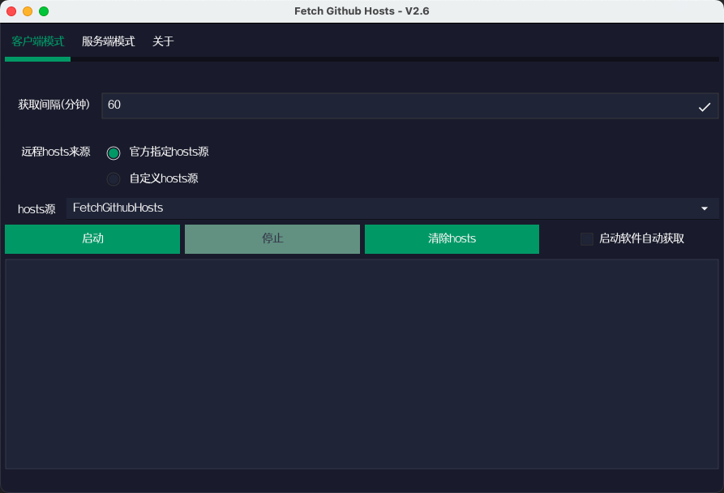
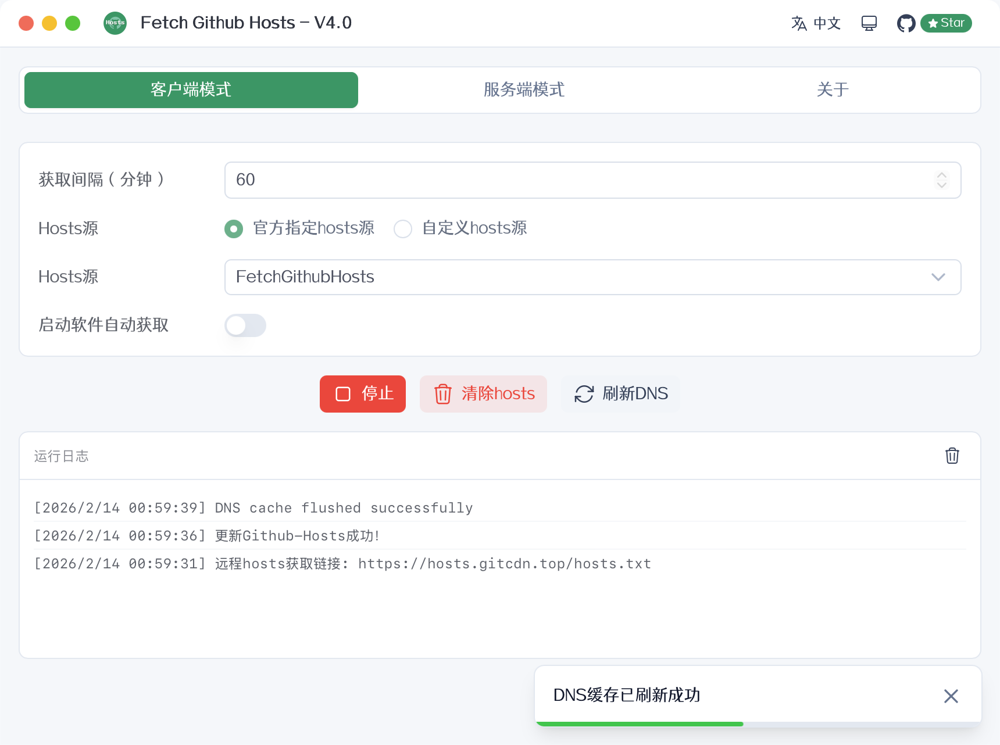
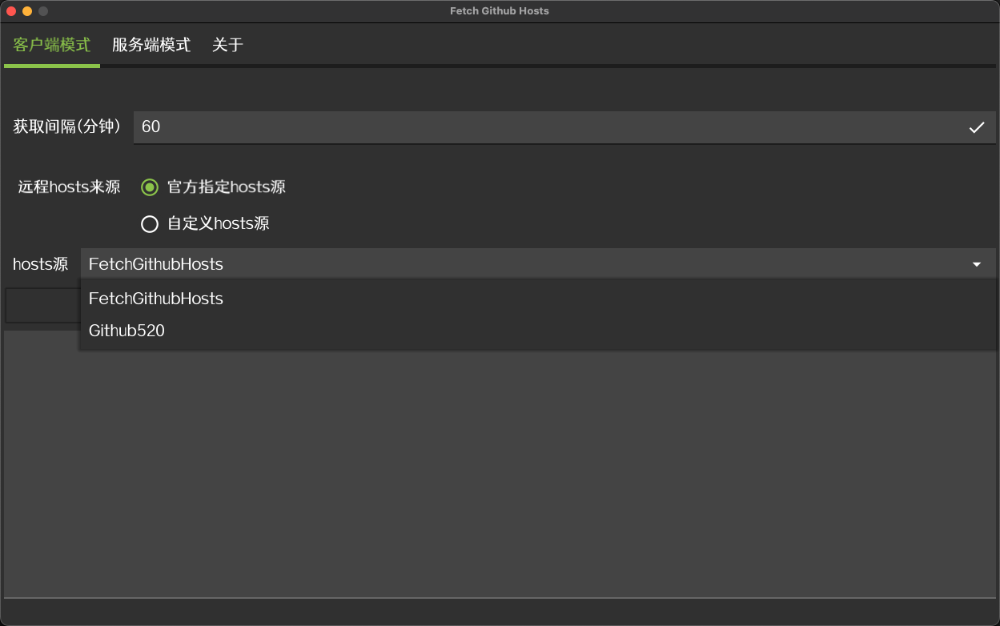
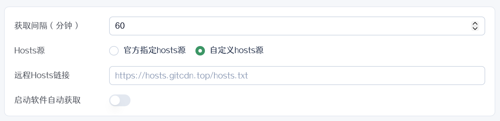
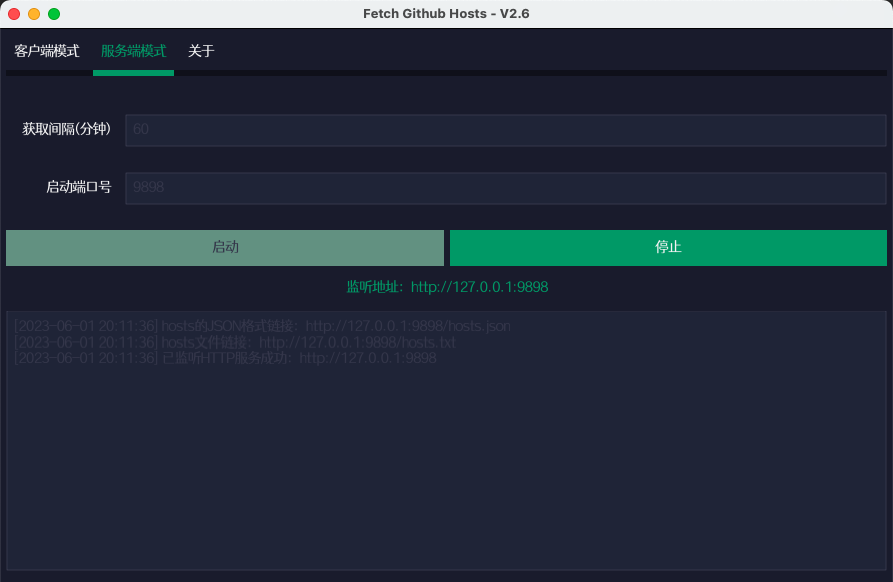

[简体中文](./README.md) | English | [日本語](./README_JA.md)

<div align="center">
<h2>Fetch GitHub Hosts</h2>


A GitHub Hosts synchronization tool designed to help researchers and learners access GitHub faster

[](https://github.com/Licoy/fetch-github-hosts/releases)
[](https://github.com/Licoy/fetch-github-hosts)
[](./LICENSE)

</div>

## ✨ Features

- 🖥️ **Cross-platform Desktop App** — Supports macOS (Intel & Apple Silicon), Windows, Linux
- 🔄 **Client Mode** — Automatically sync hosts from remote sources to your system
- 🌐 **Server Mode** — Self-hosted DNS resolution service with HTTP API
- 🌓 **Dark / Light / System** theme modes
- 🌍 **Multi-language** — 简体中文, English, 日本語
- 🔒 **Smart Elevation** — One-time password prompt, no repeated authorization needed
- 📡 **System Tray** — Run in background with one-click start/stop

## 📦 Installation

Download from [Releases](https://github.com/Licoy/fetch-github-hosts/releases):

| Platform | File Type | Architecture |
|----------|-----------|--------------|
| macOS | `.dmg` | Universal (Intel + Apple Silicon) |
| Windows | `.msi` / `.exe` | x86_64 |
| Linux | `.deb` / `.AppImage` | x86_64 |

## 🚀 Usage

### Desktop Client

Download, install, and run. The app provides a graphical user interface.

#### Client Mode

Fetches the latest GitHub DNS records from remote hosts sources and writes them to the system hosts file.

- Multiple hosts sources (FetchGithubHosts, Github520)
- Custom remote URL support
- Configurable auto-fetch interval (minutes)

#### Server Mode

Starts a local HTTP server that auto-resolves GitHub domains and serves hosts files.

- Default port: `9898`
- Provides `hosts.txt` (plain text) and `hosts.json` (JSON) formats
- Built-in web page with dark/light theme and multi-language support

### Command Line

Download your platform's binary from [Releases](https://github.com/Licoy/fetch-github-hosts/releases) and use it directly in the terminal.

#### Parameters

| Parameter | Short | Default | Description |
|-----------|-------|---------|-------------|
| `--mode` | `-m` | None (opens GUI) | Mode: `client` or `server` |
| `--interval` | `-i` | `60` | Fetch interval in minutes |
| `--port` | `-p` | `9898` | Server mode listening port |
| `--url` | `-u` | `https://hosts.gitcdn.top/hosts.txt` | Client mode remote hosts URL |
| `--template` | `-t` | None (built-in) | Server mode custom HTML template file path |
| `--lang` | `-l` | Auto-detect | Language (`zh-CN`, `en-US`, `ja-JP`) |

#### Start Client

```bash
# Linux/macOS
sudo ./fetch-github-hosts -m client

# Windows
fetch-github-hosts.exe -m client

# Custom interval (every 10 minutes)
sudo ./fetch-github-hosts -m client -i 10

# Custom URL
sudo ./fetch-github-hosts -m client -u http://127.0.0.1:9898/hosts.json
```

#### Start Server

```bash
# Linux/macOS
./fetch-github-hosts -m server

# Windows
fetch-github-hosts.exe -m server

# Custom port
./fetch-github-hosts -m server -p 6666

# Custom HTML template
./fetch-github-hosts -m server -t /path/to/template.html
```

> 💡 Custom templates support `{{FGH_VERSION}}` (version) and `{{FGH_UPDATE_TIME}}` (last update time) template variables

> 💡 Omitting the `-m` parameter launches the graphical user interface

### Manual Method

#### Add Hosts

Visit [https://hosts.gitcdn.top/hosts.txt](https://hosts.gitcdn.top/hosts.txt) and paste the content into your system hosts file.

- **Linux / macOS**: `/etc/hosts`
- **Windows**: `C:\Windows\System32\drivers\etc\hosts`

#### Flush DNS Cache

```bash
# macOS
sudo dscacheutil -flushcache && sudo killall -HUP mDNSResponder

# Windows
ipconfig /flushdns

# Linux
sudo systemd-resolve --flush-caches
```

#### One-liner for Linux/macOS

```bash
sed -i "/# fetch-github-hosts begin/Q" /etc/hosts && curl https://hosts.gitcdn.top/hosts.txt >> /etc/hosts
```

> 💡 Set up a crontab task for automatic updates

## 📸 Screenshots

#### Client Mode


#### Client Started


#### Hosts Source Selection


#### Custom Hosts Source


#### Server Mode


## 🌟 Star History

[](https://starchart.cc/Licoy/fetch-github-hosts)

## 📄 License

[GPL-3.0](./LICENSE)
